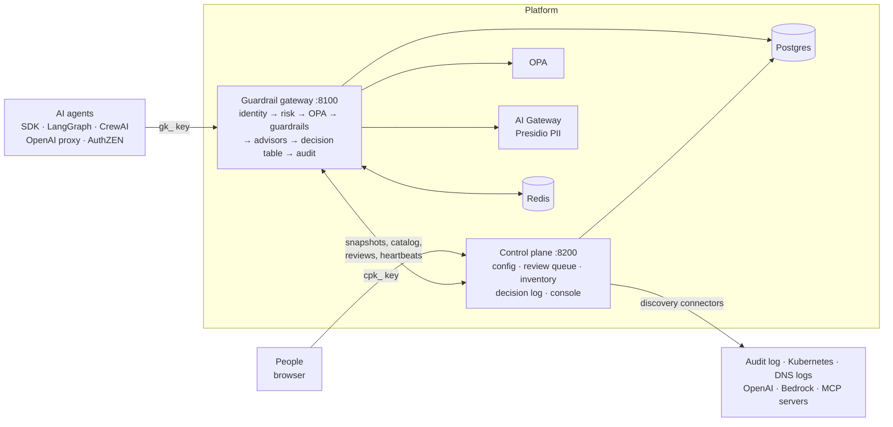

# Policy guardrails for AI agents

A security checkpoint between AI agents and what they touch. Before an agent sends a prompt, uses
retrieved documents, calls a tool (or reads its result) or returns an answer, it asks the
**guardrail gateway**. The gateway checks who the agent is, what the action really does, what the
session has done so far and whether policy allows it, runs the content guardrails you chose, and
answers **allow**, **modify** (redacted), **block** or **escalate** (a person decides). Every
decision is audited without storing the text. A **control plane** with a web console manages the
configuration, the review queue, an inventory of the agents in your environments (including the
ones nobody registered), and the decision log.

It runs with Docker Compose on a laptop and on any Kubernetes/k3s cluster with the Helm chart.

## Architecture



| Part | Code | Port |
| --- | --- | --- |
| Guardrail gateway: the agent API and every decision | `services/guardrail-gateway` | 8100 |
| Control plane: tenants, keys, guardrail registry, publishing, review queue, discovery and inventory, analytics, decision log, playground; serves the console | `services/guardrail-control-plane` | 8200 |
| Console (React) | `apps/console` | `/console` on 8200 |
| AI Gateway: the existing PII redaction service behind `ai-gateway-pii` | `services/ai-gateway` | 8000, 8001 |
| SDK: agent client, hooks, framework integrations, plugin contract | `packages/guardrail-sdk` | — |
| OPA policy, Helm chart, SOPS secrets | `policies/`, `deploy/` | — |

How one request moves through the gateway, how configuration reaches it, and how discovery feeds
risk: [docs/architecture.md](docs/architecture.md).

## What it does

| Area | What you get | Status |
| --- | --- | --- |
| **Content guardrails** | `ai-gateway-pii` (Presidio: redact or block PII on all four stages; PII to external tools blocked), `secrets` (credentials, by format), `prompt-injection` (heuristic: jailbreaks in input, injected instructions in documents and tool results), `topic-limits`, `content-moderation` (OpenAI-compatible endpoint) | Implemented and tested. `secrets` and `prompt-injection` start in shadow in dev; moderation needs a key |
| **Policy** | OPA: allowed tools per agent, trust and risk thresholds in production, delegation depth, PII must go through an enforced `ai-gateway-pii` | Implemented and tested |
| **Context and risk** | Agent-bound keys, action descriptors (SQL/HTTP/file/message), session taint and data labels, named risk signals (`NEW_RESOURCE`, `TAINTED_SESSION`, `SENSITIVE_THEN_EXTERNAL`, …), bands, a decision table; `RISK_MODE` off / **shadow** (default) / enforce | Implemented and tested |
| **Verification** | SQL dry run on a read replica, user confirmation through your IdP, or a person | Implemented and tested (IdP flow with dev tokens) |
| **Human review** | Held requests in the console's Review queue; the agent polls; undecided = blocked after 15 min | Implemented and tested |
| **Advisors** | Optional classifiers in the uncertain band, asked from derived features only; can add capped risk or ask a person, never permit; local model + HTTP/Bedrock providers; calibration from reviewers' decisions | Local: tested. HTTP/Bedrock: contract-tested only |
| **Agent discovery** | Connectors (gateway audit log, Kubernetes, DNS logs, OpenAI Admin, Bedrock/AgentCore, MCP servers) → managed / unmanaged / shadow / stale agents with evidence and findings; MCP tool definitions pinned (rug-pull detection); open findings raise risk at the gateway | gateway/DNS/MCP: tested live. Kubernetes/OpenAI/Bedrock: tested against recorded responses |
| **Operations** | Safe changes (shadow → enforce, two-person production publish, rollback), multi-tenant RBAC, append-only hash-chained audit, decision events (Redis/webhook), rate limits, mTLS, Helm chart with alerts and runbooks | Implemented; chart rendered and validated in CI |
| **Console** | Review queue, pipeline, simulate, **playground** (send real agent requests), **decision log**, inventory, connectors, analytics, advisors, keys | Implemented and tested (browser smoke test) |

The full matrix of implemented, tested, partial and planned work, with the tests behind each line,
is in [docs/architecture.md](docs/architecture.md#what-is-built-and-how-well-it-is-tested).

## Run it locally

You need Docker.

```bash
git clone https://github.com/ramsha287/policy-guardrails-agent && cd policy-guardrails-agent
docker compose up --build -d
until curl -sf localhost:8100/ready >/dev/null; do sleep 5; done
docker compose exec guardrail-control-plane cat /bootstrap/cp.env   # CP_ADMIN_KEY (you), CP_APPROVER_KEY (a second admin)
docker compose exec guardrail-gateway cat /bootstrap/dev.env        # DEMO_GATEWAY_API_KEY (an agent)
```

The first run migrates the databases and seeds a `demo` tenant: agents `research-agent` (trust
80, any tool), `support-bot` (70, `crm.lookup` and `database.read`) and `untrusted-agent` (20, no
tools), an action catalog, an unbound gateway key, and a dev pipeline with `ai-gateway-pii`
enforced and `secrets` and `prompt-injection` in shadow. The seed only loads into fresh volumes:
`docker compose down -v` starts over.

**Act as an agent** with the gateway key:

```bash
curl -s localhost:8100/v1/guard/input -H "X-API-Key: gk_..." -H 'content-type: application/json' -d '{
  "agent_id": "research-agent", "action": "llm.chat", "session_id": "s1", "data_classification": "PII",
  "payload": {"text": "Email jane.doe@example.com about invoice EMP-123456"}}'
```

You get `"decision": "modify"` with `Email [EMAIL_ADDRESS] about invoice [EMPLOYEE_ID]`, plus
`outcome`, `reason_codes` and a `risk` block. A US SSN gives `block`.

Optional parts of the stack:

```bash
docker compose --profile discovery-demo up -d mcp-demo                 # a demo MCP server for discovery
RISK_MODE=enforce docker compose up -d guardrail-gateway                # apply the decision table
MODERATION_API_KEY=sk-... docker compose up -d guardrail-gateway        # content-moderation
docker compose -f docker-compose.yml -f docker-compose.mtls.yml up --build   # mTLS between services
```

## Use the console

Open http://localhost:8200/console/ and sign in with `CP_ADMIN_KEY`.

1. **Playground** (Configure): paste `DEMO_GATEWAY_API_KEY`, pick a scenario — PII, an SSN, a
   secret, a jailbreak, prompt injection in a document or a tool result, a tool the agent may not
   use, PII to an external tool, an exfiltration chain, a changed MCP tool — and **Send as agent**.
   You see the decision, the risk signals and each guardrail's result.
2. **Decision log** (Observe): every request with its reason codes, signals, guardrail findings,
   advisor answers and hash-chain position. No payload text.
3. **Pipeline**: switch `secrets` or `prompt-injection` to enforce, publish, and send the same
   scenarios again. Production changes need a second admin (**Publish approvals**).
4. **Review queue**: held requests wait here; approve or reject, and the agent's poll follows.
5. **Discovery connectors** → **Agent inventory**: run the `gateway` connector to see managed and
   shadow agents; add DNS and MCP sources; accept or resolve findings.

Every screen, role and flow: [docs/console.md](docs/console.md).

## Connect an agent

```python
from guardrail_sdk import GuardClient, GuardHooks, GuardrailBlocked

async with GuardClient("http://localhost:8100", "gk_...", agent_id="research-agent") as client:
    hooks = GuardHooks(client, data_classification="PII").with_context(user_id="u1", session_id="run-42")
    try:
        prompt = await hooks.before_llm(user_text)                 # input
        chunks = await hooks.on_retrieval(search(prompt))          # retrieval
        answer = await hooks.after_llm(await llm(prompt, chunks))  # output
    except GuardrailBlocked as exc:
        answer = f"Request blocked: {exc.reason}"
```

Tools (`guard_tool`), LangGraph, CrewAI, the OpenAI-compatible proxy (`PROXY_ENABLED=true`), user
confirmation and status codes: [docs/agent-integration.md](docs/agent-integration.md).

## Configuration

Docker Compose sets everything for a laptop. The settings you're most likely to change:

| Setting | Where | Default | Meaning |
| --- | --- | --- | --- |
| `RISK_MODE` | gateway | `shadow` | `off`, `shadow` (compute and audit the risk outcome) or `enforce` |
| `REQUIRE_BOUND_KEYS` | gateway | `false` | Refuse gateway keys not bound to one agent |
| `ADVISORS_JSON` | gateway | local advisor in shadow (Compose) | Advisors, their mode and caps |
| `VERIFY_OIDC_*`, `VERIFY_SQL_DRY_RUN` | gateway | — | User confirmation (your IdP), SQL dry run (a read replica) |
| `MODERATION_API_KEY` | gateway | — | Enables `content-moderation` |
| `OUTBOX_SINKS` | gateway | `redis` (Compose) | Decision events to Redis and/or a signed webhook |
| `TWO_PERSON_ENVIRONMENTS` | control plane | `["production"]` | Environments that need a second admin to publish |
| `AUDIT_DSN` | control plane | Compose: set | Decision log, Analytics, Advisors and the gateway connector |
| `PLAYGROUND_ENVIRONMENTS` | control plane | `[]` (Compose: `["dev"]`) | Where the console may send real agent requests |
| `REVIEW_ENCRYPTION_KEY`, `INTERNAL_TOKEN` | control plane (+ gateway) | dev values | Set real ones outside dev |

Every variable for both services, the APIs and the CLI: [docs/reference.md](docs/reference.md).
Kubernetes/k3s install, access, monitoring and upgrades: [docs/operations.md](docs/operations.md).

## Security flows at a glance

| Threat | What stops it |
| --- | --- |
| PII in prompts, documents, tool calls, answers | `ai-gateway-pii` redacts; SSNs/cards and PII to external tools are blocked; OPA requires it for PII data |
| Credentials leaking | `secrets` redacts or blocks (private keys always) |
| Jailbreaks and prompt injection | `prompt-injection` holds or blocks input and tool results and drops injected chunks; independent of detection, session taint raises the risk of later tool calls |
| Exfiltration after reading untrusted content | `TAINTED_SESSION`, `NEW_RESOURCE`, `SENSITIVE_THEN_EXTERNAL` → verify or hold in enforce mode; advisors can add friction, never permit |
| An agent doing what it may not | OPA: tool allow-lists, trust/risk thresholds; agent-bound keys stop one agent acting as another |
| Unregistered (shadow) agents and agents bypassing the gateway | Discovery finds them; open findings raise those agents' risk |
| A trusted MCP tool changing after approval | Pinned definitions; `TOOL_DEFINITION_CHANGED` until someone accepts the change |
| A platform failure | Fail-closed everywhere: no config, OPA down, guardrail error, review queue unreachable → block |
| Tampering with the record | Append-only, hash-chained audit with exported chain heads; payloads only as hashes |

## Testing

```bash
pip install -e "packages/guardrail-sdk[test]" -r services/guardrail-gateway/requirements-dev.txt -r services/guardrail-control-plane/requirements-dev.txt
pytest packages/guardrail-sdk && (cd services/guardrail-gateway && pytest) && (cd services/guardrail-control-plane && pytest)
opa test policies
(cd apps/console && npm install && npm test && npm run build && npm run e2e)
pytest tests/e2e      # against the running stack: set GUARDRAIL_E2E_URL/KEY, CONTROL_PLANE_E2E_URL, CP_E2E_ADMIN_KEY
```

The suites, the live security-flow tests, and **23 frontend test cases** that walk every main
security flow from the console (with the expected result of each): [docs/testing.md](docs/testing.md).

## MVP status and limitations

The MVP is functional end to end: agent → gateway → policy, guardrails, risk, advisors, review →
audit → console, with discovery feeding risk. What it is not yet:

- **Gate 1 is not fully measured.** Latency is measured (p99 ≈ 4–6 ms with OPA on a dev
  container, budget 15 ms); shadow-agent discovery must be run on your pilot's sources; the
  exfiltration attack-success rate (< 5%) must be measured by your security team against staging
  ([docs/testing.md](docs/testing.md#gate-1)).
- **Shadow by default.** `RISK_MODE=shadow`, and `secrets`, `prompt-injection` and the local
  advisor start in shadow. Measure on your traffic before enforcing; the local advisor's weights
  are hand-set until calibrated.
- **Heuristics.** `prompt-injection` is pattern-based and misses paraphrases; the SQL parser is
  conservative (unclear statements cost risk).
- **Not tested against real external services here:** the IdP for user confirmation, hosted
  advisors (HTTP/Bedrock), the moderation API, and the Kubernetes/OpenAI/Bedrock connectors (tested
  with recorded responses).
- **Agents must call the gateway.** There is no MCP proxy or Envoy `ext_authz` enforcement point
  yet, so a tool call is only checked when the agent (or an AuthZEN-speaking PEP) asks; discovery
  finds agents that don't. Proxy mode can't resume a held request.
- **Hardening left to the operator:** rate limits are per replica; services share one
  `INTERNAL_TOKEN` (add mTLS identities); admin keys are bearer tokens (put the console behind your
  SSO); `/metrics` has no auth (keep it in the cluster). See
  [docs/security-review.md](docs/security-review.md#known-risks-to-accept-or-fix).
- **Planned:** NATS JetStream for events, MCP elicitation for user confirmation, a response
  engine for shadow agents (egress deny), model-based injection detection, grounding, tool-argument
  and step/cost guardrails, more discovery sources (CloudTrail, Azure, GCP).

## Documentation

| Doc | For |
| --- | --- |
| [architecture.md](docs/architecture.md) | Components, request lifecycle, data flows, status matrix |
| [decisions.md](docs/decisions.md) | Risk signals, policy, decision table, advisors, verification, AuthZEN, events, audit chain |
| [guardrails.md](docs/guardrails.md) | Every guardrail and its settings; writing a new one |
| [discovery.md](docs/discovery.md) | Agent discovery and inventory, connectors, findings |
| [console.md](docs/console.md) | Using the console: roles, every screen, review, publish, playground, decision log |
| [agent-integration.md](docs/agent-integration.md) | SDK, tools, LangGraph, CrewAI, proxy mode, status codes |
| [reference.md](docs/reference.md) | APIs, every setting, CLI, repository layout |
| [operations.md](docs/operations.md) | Helm/k3s install, access and admin keys, monitoring, upgrades |
| [testing.md](docs/testing.md) | Test suites, live end-to-end, frontend test cases, Gate 1 |
| [runbooks.md](docs/runbooks.md) | One section per alert |
| [security-review.md](docs/security-review.md) | Trust boundaries, defended areas, pen-test plan, accepted risks |
