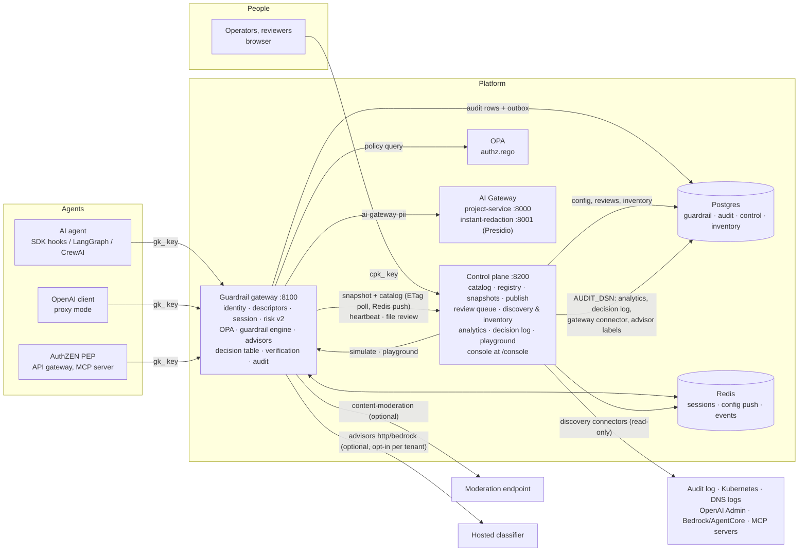
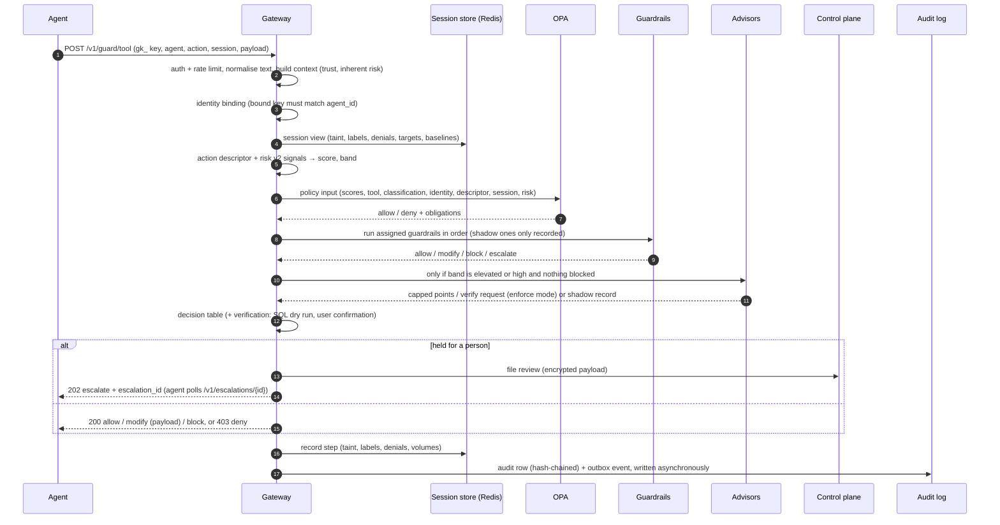
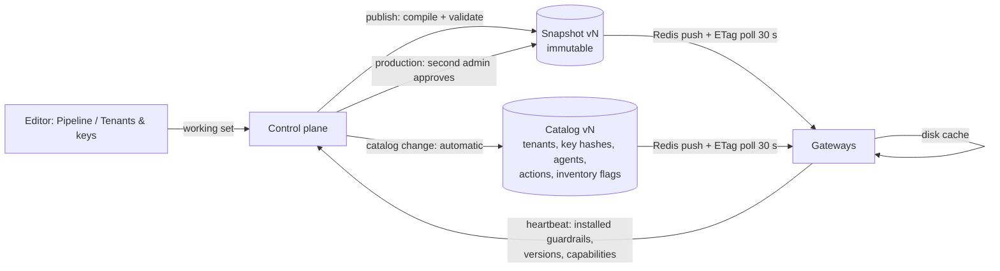
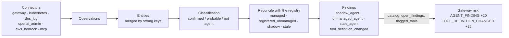

# Architecture

How the service is put together, how a request moves through it, and what is built, tested,
partly built or still planned. Every claim here was checked against the code and tests on `main`;
the [status table](#what-is-built-and-how-well-it-is-tested) says how.

## Components

| Component | Code | What it owns |
| --- | --- | --- |
| **Guardrail gateway** | `services/guardrail-gateway` | The agent-facing API. Every decision is made here, in one function (`app/gateway/flow.py: run_stage`) shared by `/v1/guard/{stage}`, proxy mode and AuthZEN |
| **OPA** | `policies/guardrails/authz.rego` | Whether the action is allowed at all (trust, risk, tools, delegation depth, required guardrails) |
| **Guardrail plugins** | `app/plugins/` | Content checks: `ai-gateway-pii`, `secrets`, `prompt-injection`, `topic-limits`, `content-moderation`, `noop` |
| **Advisors** | `app/advise/` | Optional classifiers for the uncertain risk band; can only tighten |
| **Control plane** | `services/guardrail-control-plane` | Source of truth for configuration and people's decisions: tenants, keys, agents, actions, guardrail registry, snapshots, publish approvals, review queue, discovery and inventory, admin keys, change log |
| **Console** | `apps/console` | React app served by the control plane at `/console`. Talks only to `/cp/v1` and `/inv/v1` |
| **AI Gateway** | `services/ai-gateway` | The existing PII redaction service (Presidio) behind `ai-gateway-pii` |
| **SDK** | `packages/guardrail-sdk` | Agent client and hooks, framework integrations, the plugin contract, conformance and evaluation tools, shared documents |
| **Helm chart** | `deploy/helm/guardrail-platform` | Kubernetes/k3s install with NetworkPolicies, alerts and a dashboard |

## One request, step by step

An agent calls `POST /v1/guard/{input|retrieval|tool|output}` with its gateway key, before it
sends a prompt, uses retrieved text, runs (or reads the result of) a tool, or returns an answer.

1. **Authenticate.** The `X-API-Key` hash is looked up in the catalog; per-key rate limit (429).
   No snapshot loaded → 503 (fail-closed).
2. **Context.** Trust is the agent's base trust (unknown agent: 0). Inherent risk is the action's
   base risk plus classification and environment modifiers (unknown action: 100).
3. **Identity binding.** A key bound to one agent can't act as another (`KEY_AGENT_MISMATCH`,
   403). Enforced in every `RISK_MODE`.
4. **Risk v2.** A deterministic descriptor of the action (SQL, HTTP, file, message) plus session
   state give named, capped signals (`NEW_RESOURCE`, `TAINTED_SESSION`,
   `SENSITIVE_THEN_EXTERNAL`, `AGENT_FINDING`, `TOOL_DEFINITION_CHANGED`, …) → score and band.
   See [decisions.md](decisions.md#risk-signals).
5. **Policy.** OPA decides whether the action is allowed; a denial is final (403) and no
   guardrail runs.
6. **Guardrails.** The snapshot's assignments for this environment, stage, tenant and agent run in
   order; strictest wins (block > escalate > modify > allow); errors follow `failure_mode`
   (`fail_closed` blocks). Shadow assignments run and are audited but change nothing.
7. **Advisors** (optional). Asked only in the elevated and high bands, from derived features,
   never text. Enforcing advisors add at most 20 points or ask for verification; they can't
   permit anything.
8. **Decision table** (`RISK_MODE=enforce`): critical → hold; high → verify; elevated external
   write → verify; elevated unbounded SQL read → allow with a row limit; combined with the
   guardrails' result, strongest wins. In `shadow` (the default) the table's outcome is only
   recorded as `risk.would_outcome`.
9. **Verification** turns `verify` into `allow` with evidence (SQL dry run on a read replica, the
   user's confirmation through your IdP) or into `hold` for a person.
10. **Hold.** The payload is filed in the control plane's review queue (Fernet-encrypted) and the
    agent gets 202 with an `escalation_id`. A reviewer approves (the agent's poll returns `allow`
    and the payload) or rejects; undecided after 15 minutes = blocked. Control plane unreachable
    = blocked.
11. **Record and audit.** The session is updated (taint after untrusted content, `holds:PII`
    after sensitive data, denials, quarantine in enforce mode). The audit row (decision, outcome,
    reason codes, risk and signals, guardrail results with finding *types and offsets*, the
    descriptor, advisor answers, payload SHA-256, hash-chain link) is queued and batch-written;
    raw payload text is never stored. With `OUTBOX_SINKS`, a `decision.made.v1` event is written in
    the same transaction.

## Configuration flow

- **Snapshots** (one per environment): which guardrail versions run where, in which mode, with
  which config. Published from the working set; production needs a second admin; every version
  can be rolled back. Publishing refuses a snapshot that wouldn't compile (unknown version,
  unsupported stage, config not matching the manifest schema, version not installed on the live
  gateways).
- **Catalog** (one, all tenants): tenants, gateway key hashes, agents and their allowed tools,
  action base risk, score modifiers, hosted-advisor data policy, and the inventory flags (open
  `unmanaged_agent` findings per agent, changed MCP tools). Republished on every change.
- Gateways keep the last good copies on disk. Control plane down → they keep serving; nothing
  cached at start-up → not ready (503). A snapshot that doesn't compile on a gateway (a guardrail
  version it lacks, a `${VAR}` it doesn't have) is rejected there and the previous one keeps
  serving; the error shows on `/ready`, in the heartbeat and on the console's Gateways page.
- Snapshots, catalog versions and the change log are append-only (a database trigger rejects
  UPDATE and DELETE). Snapshot versions look like `production-00012-3fa9c2d1` (environment,
  sequence, content hash).
- `CONFIG_SOURCE=file` (no control plane) reads `config/snapshots/<env>.json` and the gateway's own
  tables instead. It has no review queue (escalate becomes block) and no inventory flags.

## Discovery feeds risk

Connectors are read-only (list APIs, one audit query, MCP `tools/list` only). An MCP tool's
definition is hashed and pinned the first time it is seen; a later change opens a
`tool_definition_changed` finding until someone accepts it (which pins the new definition) or the
server reverts. Details: [discovery.md](discovery.md).

## Audit, analytics and events

| Store | Written by | Read by |
| --- | --- | --- |
| `audit.audit_events` (monthly partitions, append-only trigger, 12-month retention, per-process hash chain) | gateway, asynchronously, with a disk spool when Postgres is down | control plane through `AUDIT_DSN`: **Analytics**, **Advisors**, **Decision log**, the `gateway` discovery connector, the advisor training set; `python -m app.cli verify-audit-chain` |
| `guardrail.outbox` (same transaction as the audit rows) | gateway | the gateway's relay → Redis `events.decision.made.v1` and/or a signed webhook; hourly `audit.chain_heads.v1` |
| `control.change_log` (append-only) | control plane: every configuration change, review view and decision, publish, playground request | **Activity log** (platform keys) |
| `control.reviews` | control plane (payload encrypted, preview in clear) | **Review queue**, the gateway's escalation poll |

The audit record never contains payload text: guardrail findings carry types, offsets and scores,
the descriptor carries table/host names and counts, and the payload is kept as a SHA-256.

## Trust boundaries

- **Agents** hold gateway keys (`gk_`). A key can be bound to one agent (identity assurance A1);
  unbound keys are A0 and can be refused with `REQUIRE_BOUND_KEYS=true`.
- **People** hold admin keys (`cpk_`) with roles (`viewer`, `reviewer`, `reviewer-raw`, `editor`,
  `admin`), platform-wide or limited to one tenant. Tenant keys only see their tenant.
- **Gateway ↔ control plane** use a shared `INTERNAL_TOKEN`, optionally mTLS on separate internal
  ports (`mtls.mode=app`) or a mesh (`linkerd`).
- **Untrusted content** (retrieved documents, tool results) never becomes an instruction to the
  platform: guardrails read it as data, advisors only see derived counts, and the session is
  tainted so later external actions score higher.
- **Fail-closed** everywhere: no snapshot, OPA down, a `fail_closed` guardrail erroring, the review
  queue unreachable, an expired review — all block.

## What is built and how well it is tested

*Tested* means automated tests in this repository exercise it (unit tests with fakes, the
Postgres suites, the console's browser smoke test, or the live end-to-end suites that CI runs on
the Docker Compose stack). *Partial* means it works but has a gap listed next to it.

| Area | Status | Evidence |
| --- | --- | --- |
| Guard API (4 stages), OPA, guardrail engine, shadow/enforce, fail-closed | Implemented, tested | `test_api.py`, `test_pipeline.py`, `opa test policies`, `tests/e2e/*` (live) |
| `ai-gateway-pii` (Presidio) | Implemented, tested | `test_ai_gateway_pii*.py` (fake), the live e2e suites against real Presidio in CI, and an 880-case precision/recall report (report-only until a baseline is agreed) |
| `secrets`, `prompt-injection`, `topic-limits` | Implemented, tested | `test_content_guardrails.py`, `test_security_flows.py` (live). `prompt-injection` is a heuristic: no labelled set ships; measure in shadow first |
| `content-moderation` | Implemented, unit-tested | Tested against a mocked endpoint only; needs `MODERATION_API_KEY` to try for real |
| Identity binding, descriptors, sessions, risk v2, decision table, `RISK_MODE` | Implemented, tested | `test_contextual_flow.py`, `test_risk.py`, `test_descriptors.py`, live `test_security_flows.py` in shadow and enforce |
| Verification: SQL dry run, user confirmation (OIDC) | Implemented, tested | `test_verify.py`, `test_verification_flow.py` (dev-secret tokens). Not tested against a real IdP |
| Review queue loop (hold → decide → agent poll) | Implemented, tested | `test_services.py`, `test_api.py`, live `test_security_flows.py`, console smoke |
| Advisors: local model, panel rules, calibration | Implemented, tested | `test_advisors.py`, `test_calibrate.py`, live exfiltration flow. Local weights are hand-set until calibrated |
| Advisors: `http` and `bedrock` providers | Partial | Contract tests with stubs; not run against a real endpoint or Bedrock |
| AuthZEN API | Implemented, tested | `test_authzen.py`, `test_api.py` |
| Decision events (outbox → Redis/webhook), audit hash chain | Implemented, tested | `test_outbox.py`, `integration/test_postgres.py` |
| Control plane: catalog, registry, publish, two-person approval, rollback, RBAC | Implemented, tested | `test_services.py` (memory + Postgres), `test_api.py`, `tests/e2e/test_control_plane.py` (live) |
| Discovery: `gateway`, `dns_log`, `mcp` connectors, inventory, findings → risk | Implemented, tested | `test_discovery.py`, live `test_security_flows.py` (shadow agent, `AGENT_FINDING`, `TOOL_DEFINITION_CHANGED`) |
| Discovery: `kubernetes`, `openai_admin`, `aws_bedrock` connectors | Partial | Unit-tested against recorded/fake API responses; not run against real accounts in CI |
| Console (all screens, incl. Playground and Decision log) | Implemented, tested | vitest, Playwright smoke on a mock and on the live stack |
| Proxy mode (`/v1/chat/completions`) | Partial | `test_proxy.py`. A `verify` or `hold` comes back as 403 `guardrail_escalated`; there is no way to resume a held request through the proxy |
| Helm chart, mTLS, SOPS secrets | Implemented, partly tested | Rendered and schema-validated in CI (`kubeconform`), TLS handshake tests; no cluster install in CI |
| Fast-path latency (Gate 1: p99 < 15 ms) | Measured locally | `python -m app.bench`: p99 4.4 ms with OPA on a dev container; CI job is report-only |
| Exfiltration attack success (Gate 1: < 5%) | Not measured here | Measured by your security team against staging with an established framework ([testing.md](testing.md#gate-1)) |
| NATS JetStream event bus, Envoy `ext_authz` enforcement point, MCP elicitation for user confirmation, an MCP proxy | Planned | Redis/webhook outbox, the guard API/AuthZEN and the verification API stand in for them today |
| Response engine (cut a shadow agent's egress), model-based injection detection, grounding, tool-argument rules, step/cost limits, more discovery sources (CloudTrail, Azure, GCP) | Planned | — |
