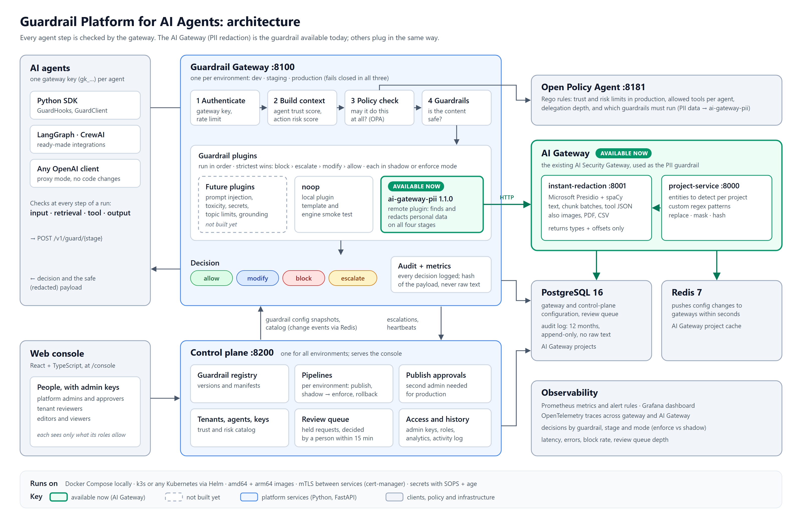

# Guardrails

A guardrail is one check the gateway runs on an agent's request, such as "does this text contain
personal data?" or "is this a prompt-injection attempt?". The platform itself doesn't depend on
any particular check. Guardrails are plugins, and you choose which ones run in each environment,
at each stage, and for which tenants and agents.

This page lists every guardrail, explains how they all work, and describes the one in production
use today: **`ai-gateway-pii`, backed by the AI Gateway**.



## At a glance

| Guardrail | What it checks | Stages | Status |
| --- | --- | --- | --- |
| **[`ai-gateway-pii`](#ai-gateway-pii-the-ai-gateway)** | Personal data (emails, names, phone numbers, SSNs, card numbers, national IDs, your own patterns), using the **AI Gateway** (Presidio) | input, retrieval, tool, output | **Available now.** On by default |
| [Policy checks (OPA)](#policy-checks-opa) | Whether the agent may do this at all: trust and risk scores, allowed tools, delegation depth, required guardrails | every stage | **Available now.** Always on, part of the gateway |
| [`noop`](#noop-the-template) | Nothing (always allows) | every stage | Available. A template and engine smoke test, not a real control |
| [Prompt injection, toxicity, secrets, topics, …](#guardrails-you-can-add) | Other kinds of content | your choice | **Not built yet.** The platform is ready for them |

> **Today, the AI Gateway is the platform's content guardrail.** Every request marked `PII` or
> `CONFIDENTIAL` must pass through `ai-gateway-pii` on input, retrieval, tool and output, or it's
> blocked. Other guardrails plug in beside it without changing the gateway, the engine or the
> policies.

## How every guardrail works

These rules apply to any guardrail, current or future.

**Stages.** An agent run has checkpoints, and a guardrail declares which ones it supports:

| Stage | What is checked |
| --- | --- |
| `input` | The prompt or messages going to the model |
| `retrieval` | Documents or chunks fetched for the model (RAG) |
| `tool` | A tool call's arguments before it runs, and its result afterwards |
| `output` | The model's answer before the user sees it |
| `agent` | Agent-level events, such as a delegation to another agent |

**Decisions.** Each guardrail answers one of:

- **allow**: carry on unchanged.
- **modify**: carry on with a changed payload, such as redacted text.
- **block**: stop the request.
- **escalate**: hold the request for a person in the console's review queue.

When several guardrails run on one stage, the strictest answer wins: **block > escalate > modify >
allow**. A modified payload goes on to the next guardrail.

**Modes.** An assignment runs in `enforce` mode, where it changes the outcome, or in `shadow` mode,
where it runs and is logged but has no effect. Start every new guardrail in shadow mode, watch it
in **Analytics**, then switch it to enforce.

**Failures.** If a guardrail errors or times out, its `failure_mode` decides the outcome. Real
guardrails use `fail_closed`, so the request is blocked, in every environment.

**Scopes.** An assignment applies to everyone (`global`), to one tenant (`tenant`, for example
`acme`) or to one agent (`agent`, for example `acme/support-bot`). For each guardrail, the most
specific scope wins.

**Kinds.** A guardrail runs in the gateway's process (`local`), as a separate HTTP service
(`remote`), or as an ML model on its own nodes (`model`).

**Privacy.** Guardrails never put raw sensitive values in their reasons, findings or logs. The
audit log keeps decisions, entity types, offsets and a hash of the payload, never the text itself.

Where to change guardrails: **Pipeline** in the [console](user-guide.md), or the
[control plane API](control-plane.md).

---

## `ai-gateway-pii`: the AI Gateway

**Status: available now, and the default content guardrail in every environment.**

`ai-gateway-pii` connects the platform to the **AI Gateway** (the existing AI Security Gateway in
`services/ai-gateway`). The AI Gateway uses [Presidio](https://microsoft.github.io/presidio/) to
find personal data and redact it. The guardrail is a thin adapter: detection, the entity list,
custom patterns and the redaction style all live in the AI Gateway, so the privacy team manages
them in one place for every product that uses it.

```text
  gateway ──▶ ai-gateway-pii ──▶ AI Gateway instant-redaction-service (:8001, Presidio)
                                        │
                                        └── project config from project-service (:8000):
                                            entities, custom regex, replace / mask / hash
```

### What it does at each stage

| Stage | What it sends to the AI Gateway | What happens with the default config |
| --- | --- | --- |
| `input` | The user's messages (`scan_roles: [user]`) | PII is redacted (**modify**). A US SSN is **blocked** |
| `retrieval` | All retrieved chunks in one batch (up to 100 per call) | PII in chunks is redacted. Chunks containing an SSN or card number, or more than 20 findings, are dropped |
| `tool` | Tool arguments and results as JSON (every string value is checked) | PII is redacted. **PII sent to a tool that leaves your network** (`http.*`, `email.*`, `slack.*`, `webhook.*`) is **blocked** |
| `output` | The assistant's answer (`scan_roles: [assistant]`) | PII is redacted. Card numbers and SSNs are **blocked** |

Every finding reports the entity type, where it was found (offsets or a JSON path such as
`$.rows[0].email`) and a confidence score. It never includes the matched value.

### What it detects

The AI Gateway project decides which entities are checked. The demo project seeded by
`docker compose` checks:

`EMAIL_ADDRESS`, `PHONE_NUMBER`, `PERSON`, `CREDIT_CARD`, `US_SSN`, `IN_AADHAAR`, `IN_PAN`, and a
custom pattern `EMP-\d{6}` redacted as `[EMPLOYEE_ID]`.

A project can turn on any of the entities the AI Gateway supports:

| Area | Entities |
| --- | --- |
| Contact and identity | `PERSON`, `EMAIL_ADDRESS`, `PHONE_NUMBER`, `LOCATION`, `URL`, `IP_ADDRESS`, `DATE_TIME`, `NRP` |
| Financial | `CREDIT_CARD`, `IBAN_CODE`, `US_BANK_NUMBER`, `CRYPTO` |
| United States | `US_SSN`, `US_ITIN`, `US_PASSPORT`, `US_DRIVER_LICENSE`, `MEDICAL_LICENSE` |
| United Kingdom | `UK_NHS`, `UK_NINO` |
| India | `IN_AADHAAR`, `IN_PAN`, `IN_PASSPORT`, `IN_VOTER`, `IN_VEHICLE_REGISTRATION` |
| Australia | `AU_ABN`, `AU_ACN`, `AU_TFN`, `AU_MEDICARE` |
| Singapore | `SG_NRIC_FIN` |
| Your own | Any regex, with the label to redact it as (for example `[EMPLOYEE_ID]`) |

The redaction style is also set per project: `replace` (`[EMAIL_ADDRESS]`), `mask` (the value
becomes `*` characters) or `hash` (HMAC-SHA256 with a per-project secret, so the same value always
gets the same token).

### Where it runs by default

| Environment | Mode | Effect |
| --- | --- | --- |
| dev | enforce | Redacts and blocks as described above |
| staging | enforce | Same as dev |
| production | **shadow** | Runs and is logged, but has no effect. Because the OPA policy requires an **enforced** `ai-gateway-pii` for `PII` and `CONFIDENTIAL` data, those requests are **blocked** in production until you switch it to enforce |

Switch production to enforce once the shadow results look right. In **Pipeline**, pick
production, set `global-ai-gateway-pii` to **enforce** and click **Request publish**. A second
admin approves it under **Publish approvals**.

### Configuration

Set in the assignment's `config` (the console's Pipeline screen, or the API):

| Setting | Meaning | Default |
| --- | --- | --- |
| `project_id` | The AI Gateway project to use (required) | — |
| `base_url` | Where the AI Gateway's instant-redaction-service is | `http://instant-redaction-service:8001` |
| `input.on_detect`, `output.on_detect` | What to do when PII is found: `modify`, `block` or `allow` | `modify` |
| `input.block_entities`, `output.block_entities` | Entity types that always block | none |
| `input.scan_roles`, `output.scan_roles` | Which message roles to check | `user` on input, `assistant` on output |
| `retrieval.on_detect` | As above, for retrieved chunks | `modify` |
| `retrieval.block_entities` | Chunks containing these are dropped | none |
| `retrieval.drop_chunk_if_entities_gt` | Drop a chunk with more findings than this | no limit |
| `tool.arguments`, `tool.result` | `on_detect` and `block_entities` for each side of a tool call | `modify` |
| `tool.external_tools` | Tool name patterns that leave your network | none |
| `tool.external_on_detect` | What to do with PII going to those tools: `block` or `modify` | `block` |

The full example is `global-ai-gateway-pii` in
`services/guardrail-gateway/config/snapshots/dev.json`.

### Versions

| Version | Stages | Notes |
| --- | --- | --- |
| 1.1.0 | input, retrieval, tool, output | Current. Latency budget 800 ms for a batch of 20 chunks, about 300 ms for text |
| 1.0.0 | input, output | Kept so you can roll back |

Both use `fail_closed`: if the AI Gateway is down or slow (time-out 1.5 s), the request is blocked.

### Quality

`eval/datasets/pii_v1.jsonl` has 880 labelled cases (220 per stage, half with PII and half with
look-alikes such as order numbers). The e2e CI job measures precision and recall against the real
AI Gateway. See [eval/README.md](../eval/README.md).

### Code and related docs

- Adapter: `services/guardrail-gateway/app/plugins/ai_gateway_pii/`
- AI Gateway: `services/ai-gateway/` (project-service and instant-redaction-service)
- What changed in the AI Gateway for this platform: [ai-gateway-changes.md](ai-gateway-changes.md)
- If it's failing: [runbooks/guardrail-errors.md](runbooks/guardrail-errors.md)

---

## Policy checks (OPA)

**Status: available now, always on.**

Before any guardrail runs, the gateway asks OPA whether the agent may make this request at all.
Guardrails decide whether the **content** is safe, and OPA decides whether the **action** is
allowed. A policy denial returns `403` with the reason.

The starter policy (`policies/guardrails/authz.rego`):

| Rule | Where |
| --- | --- |
| Agent trust score must be at least 50 | production |
| Action risk score must be at most 70 | production |
| Delegation chains may be at most 3 deep | everywhere |
| Tools must be on the agent's allowed list (`*` allows all) | tool stage |
| `ai-gateway-pii` must run, **enforced**, for `PII` or `CONFIDENTIAL` data | input, retrieval, tool, output |

Trust and risk scores come from **Tenants & keys** in the console. How they're calculated:
[reference.md](reference.md#scoring-separate-agent-and-action-scores).

## `noop`: the template

**Status: available, but it isn't a safety control.**

`noop` always allows. It runs in shadow mode in every environment to prove the engine runs local
guardrails, and it is the starting point for writing your own (`services/guardrail-gateway/app/plugins/noop/`).

## Guardrails you can add

**None of these are built yet.** The platform is designed for them: each would be a new plugin
with its own manifest, rolled out in shadow mode first, without changes to the gateway, engine or
policies.

| Guardrail | What it would check | Likely stages | Kind |
| --- | --- | --- | --- |
| Prompt injection / jailbreak | Instructions hidden in prompts or retrieved documents | input, retrieval | `model` or `local` |
| Toxicity and harmful content | Abusive, hateful or unsafe text | input, output | `model` |
| Secrets and credentials | API keys, passwords, private keys in text or tool calls | input, tool, output | `local` |
| Topic and scope limits | Requests outside what the agent is for | input | `local` or `model` |
| Grounding | Answers not supported by the retrieved sources | output | `model` |
| Tool argument rules | Allowed domains, amount limits, read-only checks on tool calls | tool | `local` |
| Agent step and cost limits | Runaway loops, too many steps or tokens per run | agent | `local` |

To build one, follow [adding-a-guardrail.md](adding-a-guardrail.md). It covers the manifest, the
code, the conformance tests, the labelled evaluation set, and the shadow-then-enforce rollout.
